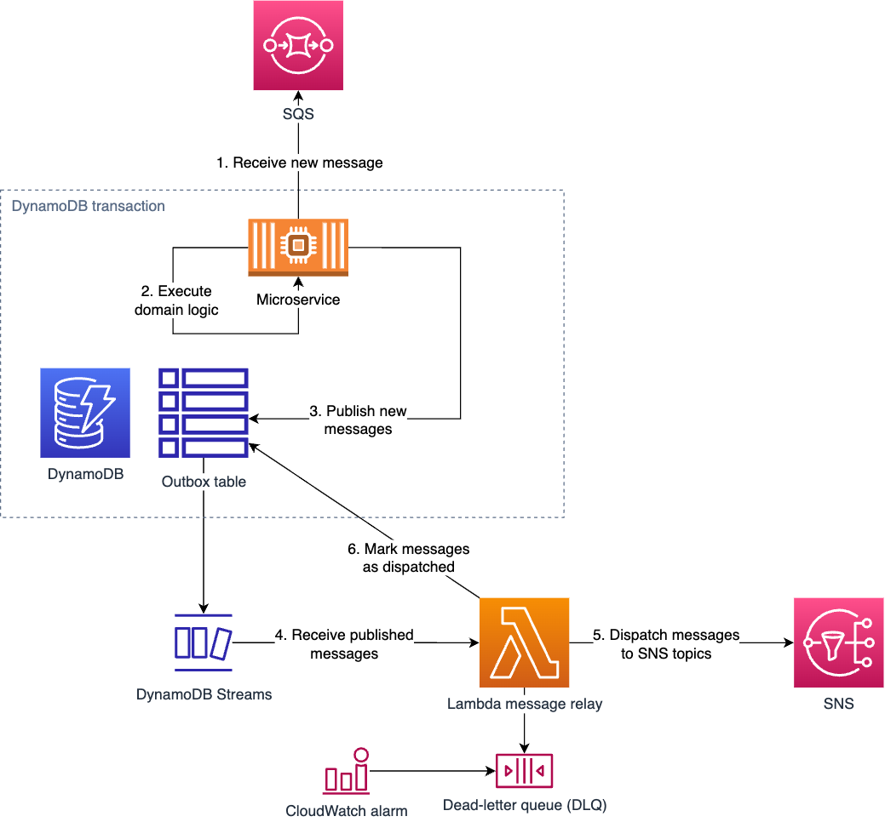
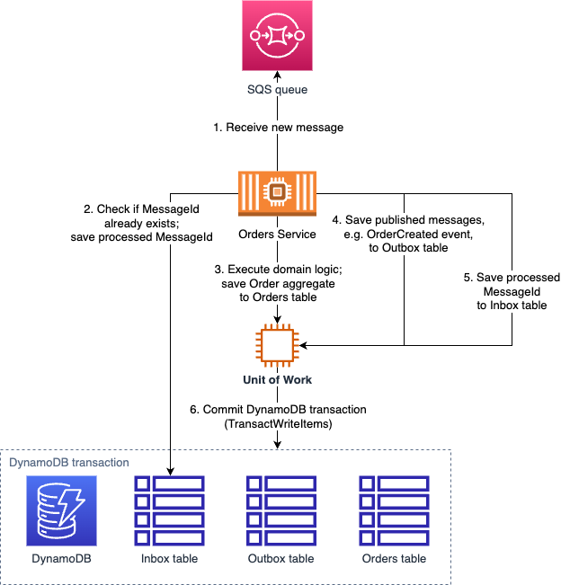

:toc:
:toc-placement: preamble
:toclevels: 2
:showtitle:

ifdef::env-github[]
:tip-caption: :bulb:
:note-caption: :information_source:
:important-caption: :heavy_exclamation_mark:
:caution-caption: :fire:
:warning-caption: :warning:
endif::[]

= Transactional Messaging Patterns - with AWS DynamoDB Streams, SNS, SQS, and Lambda

A complete example of implementing microservice transactional messaging patterns.

This project demonstrates how to apply Transactional Outbox, Transaction Log Tailing,
and Idempotent Consumer together with Unit of Work pattern using AWS DynamoDB, DynamoDB Streams, SNS, SQS, and Lambda.

== Overview

The project consists of multiple modules:

* Pattern implementations:
** link:library-transactional-messaging[library-transactional-messaging] - Transactional Messaging patterns implementation
** link:lambda-outbox-dynamodb-streams[lambda-outbox-dynamodb-streams] - AWS Lambda function that implements
    Transaction Log Tailing message relay using DynamoDB Streams for Transaction Log Tailing pattern
** link:terraform-transactional-messaging[terraform-transactional-messaging] - example Terraform module for
    `DynamoDB Streams + Lambda` Transactional Outbox deployment to AWS
** link:library-unit-of-work[library-unit-of-work] - Unit of Work pattern implementation

* Example applications that demonstrate the use of the patterns:
** link:service-customers[service-customers] - Customers service
** link:service-orders[service-orders] - Orders service
** link:deploy-terraform-aws-ecs[deploy-terraform-aws-ecs] - Terraform definitions for deploying the application stack to AWS ECS
** link:library-tomodachi-bootstrap[library-tomodachi-bootstrap] - helper library that provides common functionality for
    bootstrapping https://github.com/kalaspuff/tomodachi[tomodachi] services

== Motivation

In a software architecture that uses asynchronous messaging for inter-service communication,
additional measures need to be taken to ensure that messages are published reliably.

Asynchronous messaging has several inherent properties that need to be taken into account
when designing a system that uses asynchronous messaging. These properties require
additional countermeasures to ensure that the system behaves as expected.

=== Property: At-least-once message delivery

When message is published to a message broker, it's guaranteed to be delivered to a consumer,
but the same message can be delivered more than once.

At-least-once delivery occurs due to how a message broker replicates
the published message internally to ensure high availability, fault tolerance, and durability.
https://docs.aws.amazon.com/AWSSimpleQueueService/latest/SQSDeveloperGuide/standard-queues.html#standard-queues-at-least-once-delivery[Read more about the internals of why at-least-once delivery occurs in AWS Simple Queue Service].

==== Consequences

For the applications that use asynchronous messaging, this means that an action can be performed more than once,
which can lead to data inconsistency and bad user experience.
For example, when a user creates an order, the `Order Service` publishes `OrderCreated` message.
The message can be delivered more than once to a `Notifications Service` that sends emails to the user,
which can lead to the user receiving multiple identical emails.

==== Countermeasures

To compensate for at-least-once delivery, _message consumers_ need to be able to recognize and handle duplicate messages.
This can be achieved by implementing the https://microservices.io/patterns/communication-style/idempotent-consumer.html[Idempotent Consumer pattern].
A consumer is _idempotent_ when the same call produces the same result, or in other words,
when the same message is processed more than once, the result is the same as if the message was processed only once.

[IMPORTANT]
====
Responsibility of handling duplicate messages is now always on the _consumer_ side,
because the publisher has no way of ensuring that the message is publisher and delivered exactly once.
====

==== Implementation example

There are many ways of implementing the Idempotent Consumer pattern.
A common approach is to use an `Inbox` or `ProcessedMessages` table in a database to store unique `MessageId` of already processed messages.
When a message is received, the consumer checks if the `MessageId` is already in the `Inbox` table. If it is, the message is ignored as a duplicate.

However, some message consumers might be already idempotent by design and not require any additional measures.

image:images/AWS Idempotent Consumer.drawio.png[Idempotent Consumer pattern with DynamoDB]

=== Property: Domain inconsistency in event-driven architecture

When actions in a system are driven by asynchronous messages - events or commands -
usually a message triggers a consumer to change its internal state with a database update,
and then publish a new message to notify other consumers about the change.

For example, when a user places an order, the `Order Service` creates the order entry in the database,
and then publishes `OrderCreated` message to notify surrounding services about the new order,
so they can proceed with subsequent actions like shipping, credit checks, invoicing, notifications etc.

==== Consequences

In this process, a business transaction spans across two independent infrastructure components - a database and a message broker.
This introduces a risk of a partial failure, when the database update succeeds, but the message publishing fails.
For example, when a user places an order, the `Order Service` creates an order entry in the database,
but the `OrderCreated` message is not published due to an error in the message broker.
This can lead to a situation when the order is created in the `Order Service` database,
but surrounding services are not aware of that, and the order is not processed further.

Even though message brokers are highly-available, the message publishing can still fail due to various reasons,
for example, due to a network failure, or a message broker being temporarily overloaded.
In this example, the business transaction lacks atomicity - the property that ensures that either all operations -
database update and message publishing - succeed, or none of them succeed.

==== Countermeasures

To ensure atomicity of the business transaction implement https://microservices.io/tags/transactional%20messaging[transactional messaging]
to publish messages as part of a database transaction.

Messages that need to be published are saved to the database as part of the database transaction,
and a separate process - a _message relay_ - reads messages from the database and publishes them to the message broker.
This way, the database transaction ensures that either all operations - database update and message publishing - succeed,
or none of them succeed.

==== Implementation example

There are multiple ways of implementing transactional messaging -
with a combination of https://microservices.io/patterns/data/transactional-outbox.html[Transactional Outbox],
https://microservices.io/patterns/data/polling-publisher.html[Polling Publisher],
and https://microservices.io/patterns/data/transaction-log-tailing.html[Transaction Log Tailing] patterns.

This project demonstrates how to implement the message publisher using Transactional Outbox and Transactional Log Tailing
with https://docs.aws.amazon.com/amazondynamodb/latest/developerguide/Streams.html[AWS DynamoDB Streams].

In a Transactional Outbox pattern, messages are saved to a DynamoDB `Outbox` table as part of a DynamoDB transaction.
Then, a separate process - _message relay_ - reads or receives the messages from the `Outbox` table and publishes them to a message broker.
The message relay can be implemented with Transaction Log Tailing pattern by using DynamoDB Streams.
DynamoDB Streams capture data changes to the `Outbox` table, and publish events to a AWS Lambda function.
When a new message is saved to the `Outbox` table, DynamoDB Streams emit an `INSERT` event to the Lambda function.
The Lambda function receives the inserted message, and reliably publishes it to a message broker.



[IMPORTANT]
====
DynamoDB Streams also guarantee at-least-once delivery of data capture events,
so the chance of publishing duplicate messages is higher, and the message consumer must be idempotent by
implementing the https://microservices.io/patterns/communication-style/idempotent-consumer.html[Idempotent Consumer pattern] described in a section above.
====

=== Unit of Work - ensuring atomicity of a business transaction

Idempotent Consumer and Transactional Outbox patterns use a database layer to persist already processed
message identifiers and published messages. For the pattern implementations to work reliably,
it must be ensured that all database operations within a business transaction are atomic.
If an application is performing multiple independent database writes within a single business transaction,
it's possible that some of the writes succeed, and some fail, which can lead to data inconsistency.
Therefore, we need to introduce another puzzle piece that will keep track of all database operations
and ensure that they're committed atomically - Unit of Work pattern.

https://martinfowler.com/eaaCatalog/unitOfWork.html[Unit of Work] pattern is described by Martin Fowler in https://martinfowler.com/books/eaa.html[P of EAA book].
The Unit of Work pattern is more broad that what's required for transactional messaging - it's also responsible for figuring out what exactly needs to be
saved to the database and how to resolve concurrency conflicts, but for the purposes of transactional messaging, the atomicity aspect is the most relevant.

Therefore, we'll use another definition from the https://www.cosmicpython.com/[Cosmic Python book] -
https://www.cosmicpython.com/book/chapter_06_uow.html["Unit of Work (UoW) pattern is our abstraction over the idea of atomic operations"].

For our purposes, Unit of Work will keep a list of all database operations that need to happen within the particular business transaction,
and perform an atomic commit at the end of the transaction. The operations will include
saving a processed message identifier to the `Inbox` table, saving publishes messages to the `Outbox` table,
and saving domain objects to another aggregate table, for example, in case of the `Order Service` - the `Orders` table.

The database commit needs to be atomic, and its implementation will depend on a particular database technology.
This project uses AWS DynamoDB that supports https://docs.aws.amazon.com/amazondynamodb/latest/developerguide/transaction-apis.html[transactional operations] -
exactly what we need for our purposes. If we were using a relational database, we'd be using a familiar ACID transaction.

If you're familiar with https://www.sqlalchemy.org/[SQLAlchemy ORM], the `sqlalchemy.orm.Session` object already implements the Unit of Work pattern.
Java JPA has a similar concept of `@Transactional` annotation.
If your database doesn't support transactions, there are other ways of ensuring operation atomicity,
like writing all changes to a single aggregate document in one operation.

[TIP]
====
Patterns are not static and set in stone. They can be adapted to fit the needs of a particular use case,
or only a required part of a pattern can be used. The most useful thing about patterns is that they provide
a common language to describe a solution to a problem.
====



[NOTE]
====
See a complete AWS reference architecture diagram -
https://d1.awsstatic.com/architecture-diagrams/ArchitectureDiagrams/aws-reference-architecture-hybrid-domain-consistency-ra.pdf?did=wp_card&trk=wp_card[Domain consistency in event-driven architectures]
====

== Working Example - Customers and Orders application

The application example is inspired by https://github.com/eventuate-tram/eventuate-tram-examples-customers-and-orders[eventuate-tram/eventuate-tram-examples-customers-and-orders].

The application demonstrates three key patterns:

* https://www.cosmicpython.com/book/chapter_06_uow.html[Unit of Work] - perform a business transaction as a single atomic operation.
* https://microservices.io/patterns/data/transactional-outbox.html[Transactional Outbox] - atomically update the database and send message to a message broker.
* https://microservices.io/patterns/communication-style/idempotent-consumer.html[Idempotent Consumer] - handle duplicate messages on a consumer side.

The application consists of two services:

* `Order Service` - manages orders
* `Customer Service` - manages customers

All services are implemented using https://github.com/kalaspuff/tomodachi[tomodachi] framework that provides HTTP and AWS SNS SQS transport layers.

=== Run locally with Docker Compose

- Start applications

```bash
docker compose up
```

- Get outbox lambda logs

```bash
awslocal --region=us-east-1 logs describe-log-groups

awslocal --region=us-east-1 logs tail /aws/lambda/lambda-dynamodb-streams--customers-outbox
awslocal --region=us-east-1 logs tail /aws/lambda/lambda-dynamodb-streams--orders-outbox
```

- Check DynamoDB content with https://github.com/aaronshaf/dynamodb-admin[DynamoDB Admin] at `http://localhost:8001`

=== Sample requests

- Create customer

```bash
curl -X POST --header "Content-Type: application/json" -d '{
  "name": "Jane Doe",
  "credit_limit": 250
}' http://localhost:9701/customers
```

- Create order

```bash
curl -X POST --header "Content-Type: application/json" -d '{
  "customer_id": "97c05e79-5902-451f-b96e-f06c8fc3ed68",
  "order_total": 100
}' http://localhost:9702/orders
```

- Get customer

```bash
curl http://localhost:9701/customer/15883bbb-dbf9-4ea0-afec-b2fab1a0ab2f
```

- Get order

```bash
curl http://localhost:9702/order/a5ecbfba-32cd-4c94-bfcf-f6a4a8f8a91c
```

- Cancel order

```bash
curl -X POST http://localhost:9702/order/a5ecbfba-32cd-4c94-bfcf-f6a4a8f8a91c/cancel
```

=== Limitations

- To save storage costs, Inbox and Outbox repositories should use `DynamoDB time-to-live`
  to cleanup old items, for example, after one year.
- If a published message payload exceeds DynamoDB item size limit of `400 KB`, message saving to the database will fail.
  If large messages are expected, consider saving them in S3 and storing only a reference to the message in DynamoDB.
  Read more in https://docs.aws.amazon.com/amazondynamodb/latest/developerguide/bp-use-s3-too.html[Best practices for storing large items and attributes].
  The same bottleneck will occur in SQS too, so the same approach for transporting large SQS messages needs to be implemented.
  Read more in https://docs.aws.amazon.com/AWSSimpleQueueService/latest/SQSDeveloperGuide/sqs-s3-messages.html[Managing large Amazon SQS messages using Amazon S3].

=== Notes on running Outbox Lambda in a local environment or autotests

==== Moto: `arm64` vs `amd64` Lambda architecture

Seems that Moto ignores specified Lambda architecture name, and uses whichever `mlupin/docker-lambda` Docker image
is pulled to the local Docker daemon. If you get errors that outbox messages are not dispatched, try to
delete locally cached `mlupin/docker-lambda` images and pull them again for your machines architecture.

No such problems observed with LocalStack.

### Moto: marking messages as dispatched doesn't work with Moto

When Outbox Lambda is trying to mark a message as dispatched, Lambda goes into an infinite loop.
That's why marking messages as dispatched is disabled when running Outbox Lambda in local environment or autotests.

Seems that it happens because Moto publishes DynamoDB stream message before it returns a successful response on
DynamoDB `put_item` operation, but further debugging in Moto is required.

No such problems observed with LocalStack.

== Resources and acknowledgements

* Application example and domain problem:
** https://github.com/eventuate-tram/eventuate-tram-examples-customers-and-orders[github.com/eventuate-tram/eventuate-tram-examples-customers-and-orders]

* Application design inspiration:
** https://github.com/cosmicpython/code[github.com/cosmicpython/code]
** https://github.com/pycabook/rentomatic[github.com/pycabook/rentomatic]

* Transactional messaging implementation inspiration:
** https://github.com/eventuate-tram/eventuate-tram-core[github.com/eventuate-tram/eventuate-tram-core]

* Books:
** https://microservices.io/book[Microservices Patterns: With Examples in Java]. Book by Chris Richardson.
** https://www.cosmicpython.com/[Architecture Patterns with Python: Enabling Test-Driven Development, Domain-Driven Design, and Event-Driven Microservices]. Book by Harry Percival and Bob Gregory.
** https://leanpub.com/clean-architectures-in-python[Clean Architectures in Python: A practical approach to better software design]. Book by Leonardo Giordani.

== Development

...
